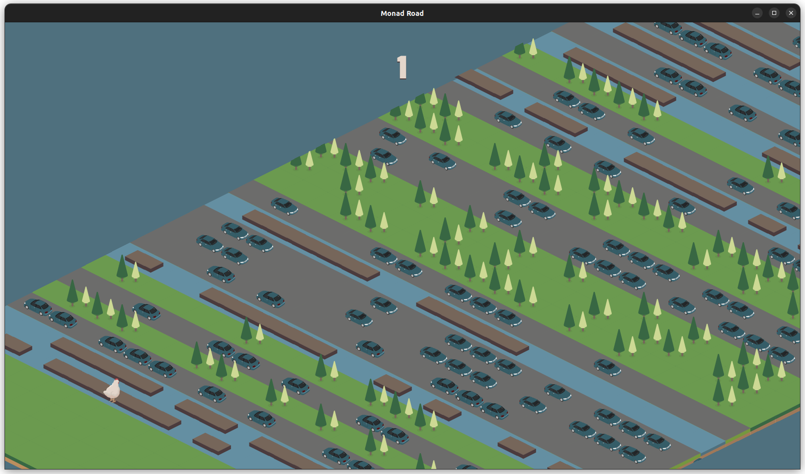
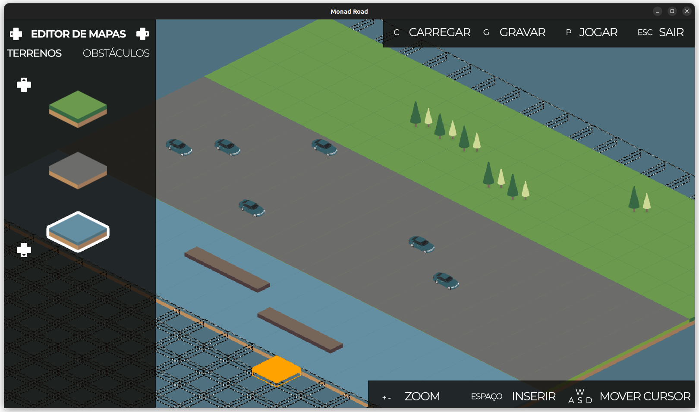

#

Clone do jogo [Crossy Road](https://en.wikipedia.org/wiki/Crossy_Road) em Haskell, usando a biblioteca [Gloss](http://gloss.ouroborus.net/), realizado no âmbito de Laboratórios de Informática I, cadeira do primeiro semestre do primeiro ano da licenciatura em Engenharia Informática da Universidade do Minho.





## Interpretador

Pode abrir o interpretador do Haskell (GHCi) utilizando o cabal ou diretamente.

1. Usando o cabal

```bash
$ cabal repl
```

2. Usando o GHCi

```bash
$ ghci -i="src" -i="tests" src/Main.hs
```

## Testes

O projeto utiliza a biblioteca [HUnit](https://hackage.haskell.org/package/HUnit) para fazer testes unitários.

Pode correr os testes utilizando uma das seguintes alternativas:

1. Usando o `cabal`

```bash
$ cabal test
```

2. Usando o GHCi

```bash
$ ghci -i="src" -i="tests" tests/Spec.hs
>>> runTestsT1 -- Correr os testes tarefa 1
>>> runTestsT2 -- Correr os testes tarefa 2
>>> runTestsT3 -- Correr os testes tarefa 3
>>> runTestsT4 -- Correr os testes tarefa 4
>>> runTestsT5 -- Correr os testes tarefa 5
>>> main -- Correr todos os testes
```

3. Usando o wrapper `runhaskell`

```bash
$ runhaskell -i="src" -i="tests" tests/Spec.hs
```

## Documentação

Pode gerar a documentação com o [Haddock](https://haskell-haddock.readthedocs.io/).

1. Usando o `cabal`

```bash
$ cabal haddock --haddock-all
```

2. Usando diretamente o `haddock`

```bash
$ haddock -h -o doc/html src/*.hs
```

## Grupo 2

- **A104356** [João d'Araújo Dias Lobo](https://github.com/joaodiaslobo)
- **A104439** [Rita da Cunha Camacho](https://github.com/ritacamacho)
